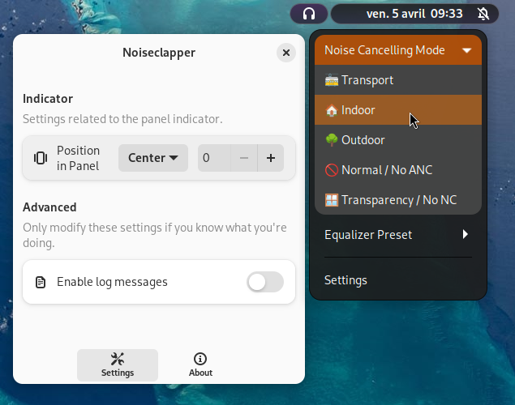

# Noiseclapper (Soundcore Life for GNOME)

## Disclaimer
This is an **unofficial** GNOME Shell extension, designed for use with Soundcore Life Q30 headphones (although it may work with other Soundcore headphones). 
I am **not** partnered with Soundcore or Anker in any way.

## Screenshot

## What is Noiseclapper ?

Noiseclapper is a GNOME Shell extension that allows you to control some settings in your Soundcore Life headphones. Normally, the official way of doing this would be to use the [official Android application](https://play.google.com/store/apps/details?id=com.oceanwing.soundcore) through your smartphone, and then set the Active Noise Cancellation mode and the Equalizer settings from there. Problem : the application is **exclusive to Android**.

So what do you do when you're using a computer ?

Well, officially, you're supposed to use the NC button or "pet" the right side of the headphones to change those settings. Again, there is a problem : you cannot choose the Active Noise Cancellation mode you want to use, and the Equalizer settings are nowhere to be seen.

~~Alternatively, you could use the [SoundcoreDesktop application](https://github.com/KillerBOSS2019/SoundcoreLifeAPI) to modify those settings, but I find it unpractical to use.~~ *([OpenSCQ30](https://github.com/Oppzippy/OpenSCQ30) now exists as an alternative, and might be better suited for those looking for advanced configuration of their headphones.)*

This extension is meant to be a solution to all these issues. On top of having all the pros of being a GNOME Shell extension (no interface to clutter your active windows, easy to access), it also provides Linux support for the control of Soundcore Life headphones, including the current Active Noise Cancellation mode and the current Equalizer preset used.

## Supported Devices
| Soundcore Life Devices | Support |
| ---- | ---- |
| Life P3 | ✓ |
| Life Q35 | ? |
| Life Q30 | ✓ |
| Life Q20+ | ? |
| Life Q20 | ? |
| Life Q10 | ? |
| Life Q10 | ? |

If your device works despite not being marked as supported, don't hesitate to create an issue or a pull request.

## Requirements

- GNOME Shell 45+ (42 - 44 with previous versions of Noiseclapper)
- Python 3
- Bluetooth support on the computer
- *(The Soundcore application must be inactive on your phone, else it will conflict for the control of your headphones with this extension.)*

### For development

- Make
- TypeScript (and related dependencies, see `package.json`)
- Blueprint v0.12.0 (or superior)

## Bug Reports / Contributions / Suggestions
You can report bugs or suggest features by making an issue, or you can contribute to this extension directly by forking it and then sending a pull request. Any help will be very much appreciated. Thank you !
